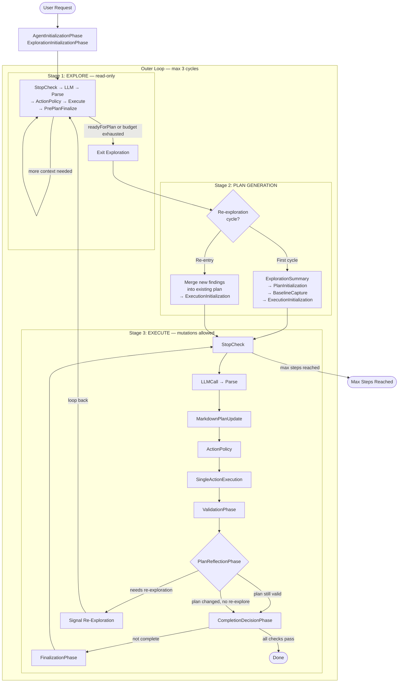
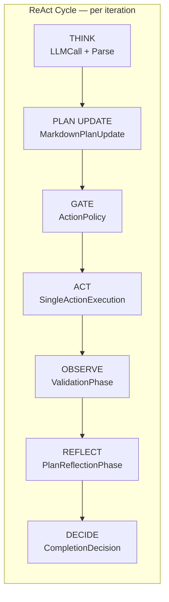
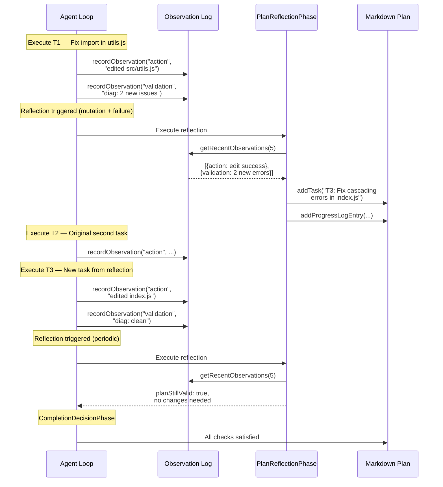
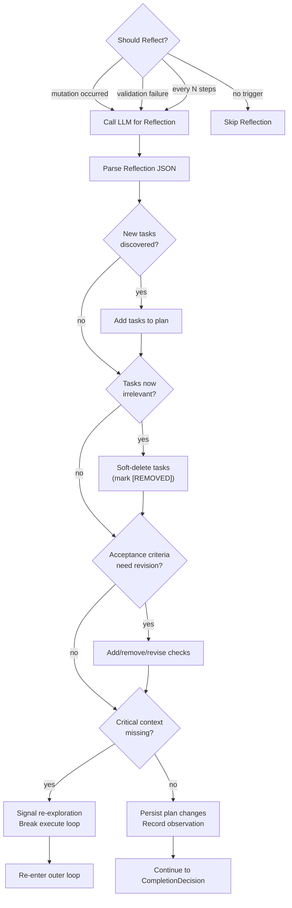

# Agent Architecture

## Detailed Design Document

---

### 1. Overview

The agent is a **cyclic ReAct (Reason → Act → Observe → Reflect)** loop orchestrated by `AgentStrategy`. It operates through three stages — **Explore**, **Plan**, **Execute** — wrapped in an outer loop that allows cycling back to exploration when the agent discovers it lacks critical context during execution.

The core design principle is **continuous plan refinement**: the plan is a living document that evolves as the agent learns. Tasks can be added or soft-deleted, acceptance criteria can be revised, and the agent can request re-exploration when its understanding proves insufficient. Observations from every action and validation feed a structured chain that the reflection phase consumes to make informed plan adjustments.

**Key source files:**

| File | Role |
|------|------|
| `AgentStrategy.js` | Top-level orchestrator; owns the outer loop, stage methods, and phase arrays |
| `AgentContext.js` | Mutable state container; extends `BaseContext` with agent-specific fields |
| `BaseContext.js` | Base class for all modes; message state, step counters, phase data carrier |
| `PhaseResult.js` | Status enum returned by every phase (`continue`, `stop`, `final`, `retry`, `failure`) |
| `EvidenceTypes.js` | Static evidence strength ladder (`NONE` → `WEAK` → `MEDIUM` → `STRONG` → `STRONGEST`) |
| `MarkdownPlanManager.js` | Plan parsing, building, and structural mutation utilities |
| `phases/*.js` | Individual phase implementations (one file per phase) |

---

### 2. High-Level Flow



---

### 3. Stage Details

#### 3.1 Initialization (One-Time)

Two phases run once at the very start before the outer loop begins:

1. **`AgentInitializationPhase`** — Reads workspace configuration (`codeCritic.*` settings), initializes `context.maxSteps` and `context.historyLimit`, infers file paths from the user request.

2. **`ExplorationInitializationPhase`** — Sets `context.stage = 'explore'`, injects the exploration system prompt (allowed tools: read/search only, no mutations), and initializes the exploration step budget (`context.prePlanMaxSteps`).

#### 3.2 Stage 1: Exploration (Read-Only)

**Purpose:** Build a mental model of the codebase before committing to a plan.

**Phase sequence per iteration:**

| # | Phase | Responsibility |
|---|-------|----------------|
| 1 | `StopCheckPhase` | Check for user cancellation |
| 2 | `LLMCallPhase` | Call the LLM with current model messages |
| 3 | `ParsingPhase` | Parse the LLM response JSON (text, toolCalls, readyForPlan) |
| 4 | `ActionPolicyPhase` | Enforce read/search-only policy; detect `readyForPlan` signal or auto-trigger it based on diagnostic coverage heuristic |
| 5 | `SingleActionExecutionPhase` | Execute one tool call (read_file, grep_search, etc.) |
| 6 | `PrePlanFinalizationPhase` | Increment `context.prePlanStep`, sync state |

**Exit conditions (checked by `AgentStrategy._runExplorationStage`):**

- **`readyForPlan` signal**: LLM responds with `{"readyForPlan": true}` and at least one successful read/search action has occurred.
- **Confidence-based exit**: All diagnostic locations from workspace errors have been read (`_hasReadAllDiagnosticLocations` heuristic).
- **Budget exhausted**: `context.prePlanStep >= context.prePlanMaxSteps`. Sets `context.explorationTruncated = true`.

**Guardrails:**
- If the LLM emits a `final` result during exploration, it is rejected with a message to use read/search tools instead.
- If `readyForPlan` fires but no successful action has occurred, the LLM is asked to perform at least one grounding read first.

#### 3.3 Stage 2: Plan Generation

**First cycle (`outerLoopCount === 1`):** Runs the `postExplorationPhases` array in order:

1. **`ExplorationSummaryPhase`** — Condenses exploration findings into structured summary (entry points, data flow, invariants, assumptions, open questions). Sets `context.stage = 'plan'`.
2. **`PlanInitializationPhase`** — LLM generates a markdown plan contract with 5 sections: Header (objective, scope, constraints), Baseline Snapshot, Acceptance Checks, Task List (patch-sized with "done when"), and Findings. Sets `context.stage = 'plan'`.
3. **`BaselineCapturePhase`** — Captures pre-edit state of build, tests, and diagnostics. Stored in `context.baseline` for regression detection.
4. **`ExecutionInitializationPhase`** — Injects the execution system prompt, enables mutation tools, sets `context.stage = 'execute'`.

**Re-exploration cycle (`outerLoopCount > 1`):** Runs `_mergeReExplorationFindings()` instead:

1. Runs `ExplorationSummaryPhase` to generate new findings.
2. Appends new findings to the existing `parsedPlan.findings.openQuestions` under a "Re-exploration findings" heading.
3. Updates the parsed plan via `context.updateParsedPlan()`.
4. Skips PlanInitialization and BaselineCapture (plan and baseline already exist).
5. Re-runs `ExecutionInitializationPhase` to re-enter execute mode.

#### 3.4 Stage 3: Execution (Mutations Allowed)

The core ReAct loop. Each iteration runs the `loopPhases` array in order:

| # | Phase | Role in ReAct Cycle |
|---|-------|---------------------|
| 1 | `StopCheckPhase` | **Guard** — Check for user cancellation or max steps |
| 2 | `LLMCallPhase` | **Think** — Call LLM with full model context |
| 3 | `ParsingPhase` | **Think** — Parse response JSON (text, toolCalls, planUpdate) |
| 4 | `MarkdownPlanUpdatePhase` | **Plan Update** — Apply checkbox toggles, findings updates, AND structural modifications (add/remove tasks, revise acceptance checks) |
| 5 | `ActionPolicyPhase` | **Gate** — Enforce read-before-write gating, deduplication |
| 6 | `SingleActionExecutionPhase` | **Act** — Execute tool call(s); records action observations |
| 7 | `ValidationPhase` | **Observe** — Run acceptance ladder (build → tests → diagnostics); records validation observations |
| 8 | `PlanReflectionPhase` | **Reflect** — Meta-cognitive check: does the plan still make sense given observations? |
| 9 | `CompletionDecisionPhase` | **Decide** — Evaluate all acceptance checks against evidence; return `final` if done |
| 10 | `FinalizationPhase` | **Housekeep** — Increment step counter, reset per-iteration flags, post state updates |

**Inter-phase data flow:** Each phase returns `PhaseResult.continue(data)`. The orchestrator sets `context.data = phaseData` before the next phase runs, allowing adjacent phases to pass structured data. Flags that must survive across non-adjacent phases (e.g., mutation status, reflection results) are stored as top-level fields on `AgentContext` to avoid being clobbered by the `context.data` replacement pattern.

---

### 4. Detailed Execute Loop (Inner Loop)



---

### 5. Observation Chain

The observation chain is the continuous thread of reasoning that connects one action to the next. Every act and observe step appends a structured record to `context.observations`, which `PlanReflectionPhase` consumes to make informed decisions about whether the plan needs updating.

**Observation schema:**

| Field | Type | Description |
|-------|------|-------------|
| `step` | `number` | `actionSeq` when observed |
| `timestamp` | `string` | ISO 8601 timestamp |
| `type` | `string` | `'action'`, `'validation'`, or `'reflection'` |
| `summary` | `string` | Compact description of what happened |
| `impactOnPlan` | `string` or `null` | How this affects the plan (null if no impact) |

**Producers:**

| Phase | Type | Example Summary |
|-------|------|-----------------|
| `SingleActionExecutionPhase` | `action` | `"edited src/utils.js"`, `"ran 'npm test' (exit 1)"` |
| `ValidationPhase` | `validation` | `"build:pass, tests:3 pass, 0 fail, diag:clean"` |
| `PlanReflectionPhase` | `reflection` | `"Plan reflection completed"` with impact details |

**Consumer:** `PlanReflectionPhase` calls `context.getRecentObservations(5)` to build the reflection prompt, providing the LLM with a structured narrative of what happened and what impact it had.



---

### 6. Plan Reflection

`PlanReflectionPhase` is a meta-cognitive step that runs after every act+observe cycle. It asks the LLM a focused question — *"Given what you just observed, does the plan still make sense?"* — using a separate, compact prompt distinct from the action-oriented execution prompt.

#### 6.1 Trigger Conditions (Cadence Control)

Reflection does not run every iteration. It triggers when any of these conditions hold:

| Trigger | Condition | Rationale |
|---------|-----------|-----------|
| **Mutation** | `context.lastActionWasMutation === true` | File writes may introduce cascading effects |
| **Validation failure** | Build/test/diagnostics regressed vs baseline | Evidence contradicts assumptions |
| **Periodic** | `context.actionSeq % 3 === 0` | Catch slow-building drift |

If none of these triggers fire, the phase returns immediately with no LLM call.

#### 6.2 Reflection Prompt

The reflection prompt is a focused, structured document containing:
- **Current plan summary**: Objective, scope, acceptance checks (with status), tasks (with status)
- **Recent observations**: Last 5 entries from the observation chain with impact assessments
- **Evidence status**: Build/tests/diagnostics compared against baseline
- **Key findings**: Entry points, invariants, open questions
- **Reflection questions**: Are all tasks still necessary? Do we need new tasks? Are acceptance criteria appropriate? Do we need to re-explore?

#### 6.3 Response Schema

The LLM responds with a JSON object:

| Field | Type | Purpose |
|-------|------|---------|
| `reasoning` | `string` | 1–2 sentence explanation (required) |
| `addTasks` | `[{title, description?, doneWhen}]` | New tasks to insert |
| `removeTasks` | `[string]` | Task IDs to soft-delete |
| `reviseAcceptanceChecks` | `[{action, originalText?, newText?}]` | Add/remove/revise checks |
| `scopeUpdate` | `{newScope, reason}` | Scope change request (requires human confirmation) |
| `needsReExploration` | `boolean` | Trigger outer loop re-entry |
| `reExplorationReason` | `string` | What context is missing |

#### 6.4 Plan Reflection Decision Tree



#### 6.5 Plan Modification Actions

| Action | Utility Function | Behavior |
|--------|------------------|----------|
| Add task | `addTask(plan, {title, description, doneWhen})` | Auto-generates next sequential ID (`T1`, `T2`, …), appends to task list |
| Remove task | `removeTask(plan, taskId)` | **Soft-delete**: prefixes title with `[REMOVED]`, marks checked. Preserves audit trail. |
| Add acceptance check | `addAcceptanceCheck(plan, text)` | Appends unchecked check to acceptance checks list |
| Remove acceptance check | `removeAcceptanceCheck(plan, text)` | Soft-delete with `[REMOVED]` prefix |
| Revise acceptance check | `reviseAcceptanceCheck(plan, originalText, newText)` | Replaces text, resets `checked` to `false` (criteria changed, needs re-validation) |
| Update scope | `updateScope(plan, newScope)` | Updates `plan.header.scope` (human confirmation gate planned) |

#### 6.6 Inter-Phase Flag Communication

Reflection sets two flags on `AgentContext` (not `context.data`, which gets overwritten by the phase data passing mechanism):

- **`context.planReflected`** — Set to `true` when reflection runs.
- **`context.planChanged`** — Set to `true` when reflection modifies the plan.

These are read by `CompletionDecisionPhase` (to skip completion checks when the plan just changed) and reset by `FinalizationPhase` at the end of each iteration.

---

### 7. Completion Decision

`CompletionDecisionPhase` evaluates whether the agent has finished its work. It runs five checks:

| Check | What It Evaluates |
|-------|-------------------|
| **Acceptance checks satisfied** | All active (non-`[REMOVED]`) acceptance checks are marked checked |
| **All tasks complete** | Every non-removed task is checked |
| **Evidence strength adequate** | Required evidence types (build/tests/diagnostics) have been collected |
| **No new diagnostics** | Current diagnostic count ≤ baseline count |
| **Within scope** | Changes appear within the defined scope boundaries |

**Guards:**

1. **Last action failed**: Skip completion check entirely — let the agent attempt recovery.
2. **Plan just changed**: If `context.planReflected && context.planChanged`, skip completion — new tasks or revised criteria have not been addressed yet.
3. **Mutation required**: If diagnostics baseline had errors and no mutations have occurred, guide the LLM toward making an edit.

When all checks pass, the phase returns `PhaseResult.final(...)` which terminates the execute loop with a `'success'` result.

---

### 8. Evidence & Definition of Done

The evidence model uses a static strength ladder defined in `EvidenceTypes.js`:

| Level | Name | Meaning |
|-------|------|---------|
| 0 | `NONE` | No evidence collected |
| 1 | `WEAK` | Code review only |
| 2 | `MEDIUM` | Build succeeds or diagnostics clean |
| 3 | `STRONG` | Tests pass + diagnostics clean |
| 4 | `STRONGEST` | Full suite + build + diagnostics all pass |

The strength ladder is the measurement **scale**. What evolves is what is being **measured against** — the acceptance checks and tasks that define "done" can be added, removed, or revised at any point during execution by either `MarkdownPlanUpdatePhase` (LLM-initiated inline) or `PlanReflectionPhase` (reflection-driven).

**Evidence flow:**

1. `BaselineCapturePhase` records the pre-edit state (`context.baseline`).
2. `ValidationPhase` runs the acceptance ladder (build → tests → diagnostics) after mutations, storing results in `context.currentEvidence` and marking `context.evidenceStale = false`.
3. `SingleActionExecutionPhase` sets `context.lastActionWasMutation = true` and `context.evidenceStale = true` on mutations.
4. `CompletionDecisionPhase` compares `currentEvidence` against `baseline` and evaluates acceptance checks.

**Evidence shapes:**

| Domain | Fields |
|--------|--------|
| Build | `{ success: boolean, exitCode: number }` |
| Tests | `{ passed: boolean, failedCount: number, passedCount: number, total: number }` |
| Diagnostics | `{ clean: boolean, count: number, problems: [] }` |

---

### 9. Outer Loop & Re-Exploration

The outer loop in `AgentStrategy.run()` wraps the three stages (Explore → Plan → Execute) and allows cycling back to exploration when the agent discovers it lacks critical context.

**Trigger:** `PlanReflectionPhase` sets `context.needsReExploration = true` with a `context.reExplorationReason` explaining what context is missing.

**Flow:**

1. Execute loop detects `context.needsReExploration` after an iteration and returns `'continue'` to the outer loop.
2. Outer loop calls `_prepareReExploration(context)`:
   - Captures the re-exploration reason before resetting.
   - Resets exploration counters (`prePlanStep`, `prePlanHasSuccessfulAction`).
   - Sets a **halved exploration budget** (`Math.floor(originalBudget / 2)`) — re-exploration is targeted, the agent already knows what it's looking for.
   - Clears `needsReExploration` and `reExplorationReason`.
   - Resets per-cycle state: `planReflectionCount`, `planReflected`, `planChanged`.
   - Preserves plan, baseline, evidence, and observations.
   - Adds a focused model message: *"Focus exploration on: {reason}."*
3. Outer loop re-enters Stage 1 (exploration) with the shorter budget.
4. Stage 2 detects `outerLoopCount > 1` and runs `_mergeReExplorationFindings()` instead of generating a new plan:
   - Runs `ExplorationSummaryPhase` for new findings.
   - Appends findings to `parsedPlan.findings.openQuestions`.
   - Skips plan regeneration and baseline capture.
5. Stage 3 resumes execution with the enriched plan.

**Safety limit:** Maximum 3 outer loop cycles. If the agent still cannot resolve context gaps after 3 cycles, the problem requires human input.

---

### 10. Context Architecture

#### 10.1 Inheritance

```
BaseContext (message state, step counters, phase data carrier, deps)
  └── AgentContext (exploration state, plan, evidence, observations, inter-phase flags)
```

`BaseContext` is shared by all modes (agent, chat, planner). `AgentContext` adds agent-specific state.

#### 10.2 Key AgentContext State Groups

| Group | Fields | Purpose |
|-------|--------|---------|
| **Stage control** | `stage`, `userRequest` | Current agent stage (`init`, `explore`, `plan`, `execute`, `reflect`) |
| **Exploration** | `prePlanStep`, `prePlanMaxSteps`, `prePlanHasSuccessfulAction`, `explorationSummary`, `explorationTruncated`, `readActions` | Exploration budget and progress tracking |
| **Plan** | `markdownPlan`, `parsedPlan`, `planDisplayed`, `currentPhase` | Markdown plan contract and parsed structure |
| **Evidence** | `baseline`, `currentEvidence`, `evidenceStale`, `evidenceLog`, `completionContract` | Baseline snapshot, current evidence, staleness tracking |
| **Deduplication** | `lastCommandSignature`, `sawMutationSinceCommand`, `lastSearchSignature`, `sawSearchMiss`, `sawMutationSinceSearch` | Prevent duplicate commands/searches |
| **Read-before-write** | `actionSeq`, `lastReadStepByPath`, `lastWriteStepByPath` | Enforce reading a file before editing it |
| **Outer loop** | `needsReExploration`, `reExplorationReason`, `outerLoopCount`, `planReflectionCount` | Re-exploration state and cycle tracking |
| **Inter-phase flags** | `lastActionWasMutation`, `planReflected`, `planChanged` | Flags that survive across non-adjacent phases (stored as top-level fields, not on `context.data`) |
| **Observations** | `observations` | Structured observation chain (array of typed records) |
| **Human input** | `awaitingHumanInput`, `pendingQuestion` | Pause/resume for human-in-the-loop |
| **Failure tracking** | `consecutiveFailures` | Abort after too many consecutive tool failures |

#### 10.3 Stage Transitions & Message Pruning

When `context.setStage(stage)` is called, `pruneStageInstructions()` removes model messages tagged with markers from other stages. This keeps the model context focused on the current stage and prevents instruction bleed.

Recognized stage markers:

| Stage | Markers |
|-------|---------|
| `explore` | `[[STAGE:EXPLORE]]`, exploration tool restrictions |
| `plan` | `[[STAGE:PLAN]]`, exploration summary prompt |
| `execute` | `[[STAGE:EXECUTE]]`, execution stage entry |
| `reflect` | `[[PLAN_REFLECTION]]`, reflection prompt |

---

### 11. Markdown Plan Structure

The plan is a markdown document parsed by `MarkdownPlanManager.parseMarkdownPlan()` into a structured object and rebuilt by `buildMarkdownPlan()`. It consists of 5 sections:

**Section 0 — Header:**
- Objective, Context, Constraints, Scope boundaries, Out of scope

**Section 1 — Baseline Snapshot (before edits):**
- Baseline build, tests, IDE diagnostics, behavior observations

**Section 2 — Acceptance Checks (exit criteria):**
- Checkbox list of conditions the agent may stop only when ALL are satisfied
- Checks may be added, removed (soft-delete with `[REMOVED]` prefix), or revised at runtime

**Section 3 — Task List (patch-sized):**
- Each task has auto-generated ID (`T1`, `T2`, …), title, description, and "done when" criteria
- Tasks may be added or soft-deleted at runtime
- Soft-deleted tasks show `[REMOVED]` prefix and are marked checked, preserving audit trail

**Section 4 — Findings (Living Notes):**
- Entry points, Data flow, Invariants, Assumptions, Open questions
- Re-exploration findings are appended to Open questions on subsequent outer loop cycles

**Section 5 — Progress Log (evidence ledger):**
- Sequential evidence entries (`obs-001`, `obs-002`, …) documenting what was observed at each step

**Structural modification utilities** (exported from `MarkdownPlanManager.js`):

| Function | Behavior |
|----------|----------|
| `addTask(plan, spec)` | Auto-ID, append unchecked task |
| `removeTask(plan, taskId)` | Soft-delete: `[REMOVED]` prefix, mark checked |
| `addAcceptanceCheck(plan, text)` | Append unchecked check |
| `removeAcceptanceCheck(plan, text)` | Soft-delete: `[REMOVED]` prefix, mark checked |
| `reviseAcceptanceCheck(plan, old, new)` | Replace text, reset `checked = false` |
| `updateScope(plan, newScope)` | Update `plan.header.scope` |
| `getPendingTasks(plan)` | Returns unchecked tasks, filtering out `[REMOVED]` |
| `getCompletedTasks(plan)` | Returns checked tasks |
| `areAllAcceptanceChecksSatisfied(plan)` | Checks all non-removed checks are satisfied |
| `getAcceptanceCheckRequirements(plan)` | Returns acceptance check details |

These are used by both `MarkdownPlanUpdatePhase` (LLM-initiated via `planUpdate` in parsed response) and `PlanReflectionPhase` (reflection-driven).

---

### 12. Phase Data Flow

#### 12.1 `context.data` — Ephemeral Phase-to-Phase

Each phase returns `PhaseResult.continue(data)`. The orchestrator stores `result.data` and assigns it to `context.data` before the next phase runs. This means each phase's return data overwrites the previous phase's data.

**Implication:** Data in `context.data` only reliably survives between **adjacent** phases. For example:
- `SingleActionExecutionPhase` returns `{ isMutation: true }` → `ValidationPhase` reads `context.data?.isMutation` correctly (adjacent phases).
- `ValidationPhase` returns `{ evidence, validationComplete: true }` → this overwrites `isMutation` before `PlanReflectionPhase` runs.

#### 12.2 Top-Level Context Fields — Persistent Across Phases

Flags that must survive across non-adjacent phases are stored as top-level fields on `AgentContext`:

| Field | Producer | Consumer | Reset By |
|-------|----------|----------|----------|
| `lastActionWasMutation` | `SingleActionExecutionPhase` | `PlanReflectionPhase` | `FinalizationPhase` |
| `planReflected` | `PlanReflectionPhase` | `CompletionDecisionPhase` | `FinalizationPhase` |
| `planChanged` | `PlanReflectionPhase` | `CompletionDecisionPhase` | `FinalizationPhase` |
| `needsReExploration` | `PlanReflectionPhase` | `AgentStrategy` (outer loop) | `_prepareReExploration()` |

`FinalizationPhase` resets the per-iteration flags (`lastActionWasMutation`, `planReflected`, `planChanged`) at the end of every execute loop iteration so they do not persist into the next iteration.

---

### 13. Safety Boundaries

| Boundary | Value | Rationale |
|----------|-------|-----------|
| Max outer loops | 3 | Prevents infinite re-exploration. If 3 cycles cannot resolve context gaps, the problem needs human input. |
| Re-exploration budget | Half of original | Re-exploration is targeted — the agent already knows what it's looking for. |
| Reflection cadence (periodic) | Every 3 execute steps | Balances thoroughness vs LLM cost. Always triggers on mutations and failures regardless. |
| Max reflections per outer loop | 10 | Hard cap to prevent reflection from consuming the step budget. |
| Soft-delete vs hard-delete | Soft-delete only | `[REMOVED]` prefix preserves audit trail. Removed items remain visible but do not block completion. |
| Read-before-write gating | Enforced by `ActionPolicyPhase` | Prevents blind edits; agent must read a file before writing to it. |
| Consecutive failure abort | Tracked on `context.consecutiveFailures` | Prevents infinite retry loops on tool failures. Reset on any success. |
| Duplicate detection | Command, search, edit, and read deduplication | Prevents the LLM from repeating the same action without mutations in between. |

---

### 14. File Inventory

| File | Approx Lines | Role |
|------|-------------|------|
| **Core** | | |
| `AgentStrategy.js` | 516 | Orchestrator: outer loop, stage methods, phase arrays |
| `AgentContext.js` | 478 | Mutable state container |
| `BaseContext.js` | 159 | Base class: messages, steps, deps |
| `PhaseResult.js` | 106 | Status enum for phase results |
| `EvidenceTypes.js` | 60 | Static evidence strength ladder |
| `ContractTypes.js` | — | Completion contract type definitions |
| **Phases** | | |
| `AgentInitializationPhase.js` | — | Config init |
| `ExplorationInitializationPhase.js` | — | Exploration setup, system prompt |
| `StopCheckPhase.js` | — | Cancellation / max step check |
| `LLMCallPhase.js` | — | LLM invocation |
| `ParsingPhase.js` | — | Response JSON parsing |
| `ActionPolicyPhase.js` | — | Read/search enforcement, dedup, read-before-write |
| `SingleActionExecutionPhase.js` | 602 | Tool execution, action observation recording |
| `PrePlanFinalizationPhase.js` | — | Exploration step increment |
| `ExplorationSummaryPhase.js` | — | Structured findings generation |
| `PlanInitializationPhase.js` | — | Markdown plan generation |
| `BaselineCapturePhase.js` | — | Pre-edit baseline snapshot |
| `ExecutionInitializationPhase.js` | — | Execute stage entry |
| `MarkdownPlanUpdatePhase.js` | 167 | Checkbox toggles + structural plan mutations |
| `ValidationPhase.js` | 547 | Acceptance ladder, validation observation recording |
| `PlanReflectionPhase.js` | 435 | Meta-cognitive plan reflection |
| `CompletionDecisionPhase.js` | 394 | Evidence-based completion evaluation |
| `FinalizationPhase.js` | 55 | Step increment, per-iteration flag reset |
| **Utilities** | | |
| `MarkdownPlanManager.js` | 597 | Plan parse/build/mutate utilities |
| `toolUtils.js` | — | Tool normalization, dedup, failure tracking |
| `diagnosticsUtils.js` | — | Diagnostic filtering by context |
| `buildUtils.js` | — | Build command discovery |
| `testUtils.js` | — | Test command discovery |
| `planUtils.js` | — | Plan utility helpers |
| `requestUtils.js` | — | Request parsing utilities |
| `SelfCorrectionPrompts.js` | — | LLM self-correction prompt templates |
